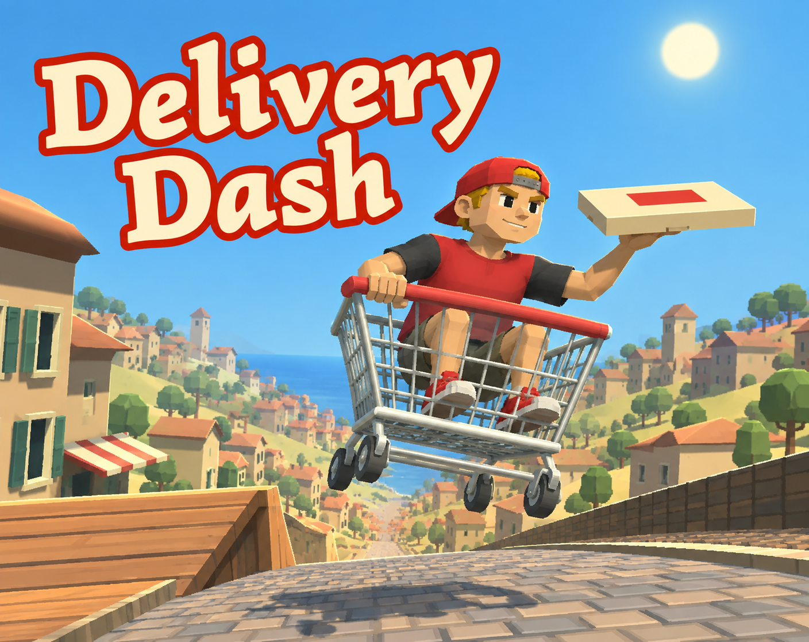
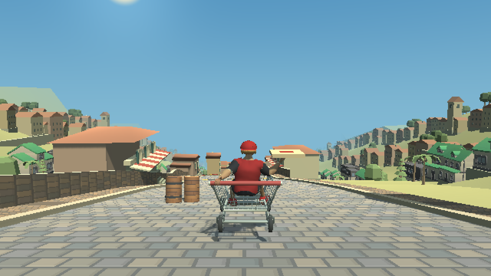
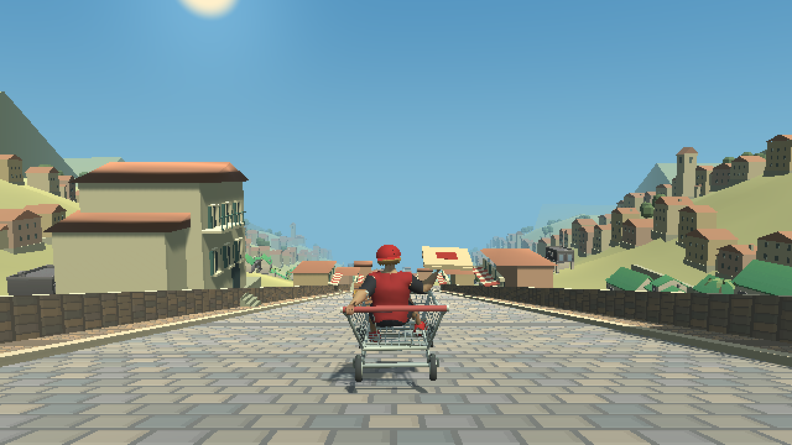

  

# Delivery Dash

**Arcade · One pizza. One shopping cart. All downhill.**

A courier rides a shopping cart through a hillside town, balancing a pizza box while the road does everything it can to interrupt the delivery.

[Play in your browser](https://pranit-gandhi.itch.io/delivery-dash)

## The game

Steer through corners, ramps, traffic, and spills. Choose a route at the forks, protect the pizza, and reach the customer before the timer runs out. The cart drives forward automatically, so the focus stays on steering and reading the road.

- Seeded procedural roads assembled from gameplay modules.
- Branching routes, obstacle patterns, and changes in road surface.
- Ramps and landings with cart, rider, and pizza feedback.
- A finite delivery run scored by progress, landings, time, and pizza condition.

## In-game screenshots

## Controls

- **A / D** or **Left / Right Arrow** to steer.
- Forward movement is automatic.
- **Enter** to start or continue from the available menu state.
- **Esc** to pause or resume.

Use **New Road** to generate another route.

## Development

Built with **Unity 6000.2.14f1**, **C#**, and **Universal Render Pipeline**. The browser version uses WebGL.

1. Open the repository in Unity 6000.2.14f1.
2. Open `Assets/DeliveryDash/Downhill/Scenes/DownhillRun.unity`.
3. Enter Play Mode.

The downhill implementation lives in `Assets/DeliveryDash/Downhill/`. `CourseGraph` and `RouteModule` define the road and generation rules; `CourseMeshBuilder` builds the road geometry; `DownhillCart` handles movement; `DownhillSession` manages the delivery run.

Generation uses bounded attempts, geometry checks, and a fallback course. These checks describe the generator's constraints; difficulty and game feel still depend on playtesting.

## Credits

Developed by **Pranit Singh Gandhi**.

Asset-source notes are included alongside the relevant art, music, and third-party assets. The cover art is shown above; the gallery contains in-game screenshots.
